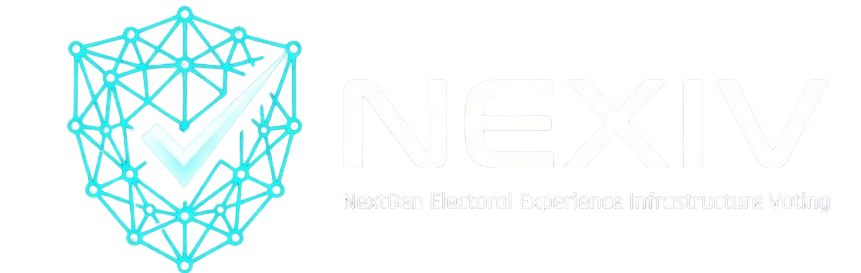

<div align="center">

<!-- Animated Title -->

<br/>

**Next-Generation Electoral Experience Infrastructure & Voting**

*Securing democracy through mathematics, not institutional faith.*

<br/>

[](https://polygon.technology)
[](https://nextjs.org)
[](https://nestjs.com)
[](https://postgresql.org)
[](LICENSE)
[]()

<br/>

> **"We didn't build a voting app. We built cryptographic proof that every Indian vote counts —**
> **permanently, transparently, and beyond the reach of any authority to alter."**

<br/>

---

</div>

## 🗳️ What is NEXIV?

NEXIV is India's first **enterprise-grade, AI-augmented, blockchain-powered civic voting platform** that transforms every vote into a cryptographically verifiable, permanently immutable, publicly auditable transaction on the Ethereum blockchain.

Every vote cast on NEXIV generates a **unique transaction hash** — a cryptographic receipt verifiable by any citizen, on any device, at any time, on any public Ethereum block explorer. No trust in NEXIV required. No trust in any government required. **Mathematical proof replaces institutional faith.**

<div align="center">

```
Citizen → Biometric Auth → Blockchain Transaction → Immutable Storage → Receipt → Live Dashboard
```

</div>

---

## ⚡ The Problem We're Solving

India conducts elections for **900+ million voters** across **1 million+ polling booths** — yet:

| Problem | Reality |
|---|---|
| 🔓 No Vote Proof | EVMs have zero cryptographic receipt. Your vote disappears into a black box. |
| 👁️ Zero Transparency | Centralized counting with no independent audit capability. |
| 🚫 252M Excluded | Disabled, migrant, and remote voters structurally denied their franchise. |
| 📊 No Intelligence | ₹10,000 crore per election cycle. Zero real-time civic data generated. |
| ⚠️ No Audit Trail | Legal challenges take years. Insufficient digital evidence exists. |

> **2024 General Election: 642 million votes. 44 days. 1% fraud = 6.4 million manipulated outcomes.**

---

## 🔑 Six Reasons No Competing System Comes Close

<details>
<summary><b>🔐 USP 1 — Cryptographic Vote Sovereignty</b></summary>
<br/>
Every vote generates a unique blockchain transaction hash. Citizens verify their vote on Etherscan — no trust in NEXIV required. Mathematically provable democracy — the first of its kind in India.
</details>

<details>
<summary><b>⛽ USP 2 — Gasless Civic Participation</b></summary>
<br/>
Zero cryptocurrency knowledge. Zero wallet. Zero fees for voters. NEXIV's admin wallet absorbs all blockchain costs — delivering Web3 security with Web2 simplicity. India's 900 million voters need only a phone.
</details>

<details>
<summary><b>🧬 USP 3 — Biometric Privacy by Architecture</b></summary>
<br/>
Facial recognition runs entirely in the voter's browser via face-api.js. Biometric data is never transmitted to any server. Privacy enforced by physics, not policy.
</details>

<details>
<summary><b>🤖 USP 4 — AI Civic Intelligence Engine</b></summary>
<br/>
Real-time demographic segmentation — Youth, Women, Farmers, Business, Senior Citizens. Predictive turnout modeling per constituency. Anomaly detection for suspicious voting patterns. Election Commission-grade oversight for the first time.
</details>

<details>
<summary><b>📋 USP 5 — Immutable Audit Trail</b></summary>
<br/>
Every system action logged with blockchain anchor hash. No operator — including NEXIV itself — can modify or suppress audit records. Court-admissible digital evidence by design.
</details>

<details>
<summary><b>✅ USP 6 — Double Vote: Mathematically Impossible</b></summary>
<br/>
Smart contract's <code>hasVoted</code> mapping enforces one-vote-per-address at protocol level. Even a full insider conspiracy cannot produce a second vote for the same citizen. Trustless democracy.
</details>

---

## 🏗️ Architecture

```
┌─────────────────────────────────────────────────────────────┐
│                        NEXIV PLATFORM                        │
├───────────────┬───────────────┬──────────────┬──────────────┤
│   IDENTITY    │    VOTING     │  ANALYTICS   │    AUDIT     │
│               │               │              │              │
│  Aadhar OTP   │  Next.js UI   │  Python      │  Blockchain  │
│  Face Biom.   │  NestJS API   │  FastAPI     │  Anchor Log  │
│  JWT + RBAC   │  Solidity SC  │  Scikit-learn│  Cloudflare  │
│  face-api.js  │  Ethers.js    │  Bull Queue  │  WAF + DDoS  │
└───────────────┴───────────────┴──────────────┴──────────────┘
                         │
                         ▼
              ┌─────────────────────┐
              │   POLYGON MAINNET   │
              │  Immutable Vote DB  │
              │   65,000 TPS        │
              │   <₹0.01 / vote     │
              └─────────────────────┘
```

---

## 🛠️ Tech Stack

### Blockchain


### Frontend


### Backend


### DevOps & Security


---

## 📁 Project Structure

```
nexiv/
├── blockchain/                  # Solidity contracts + Hardhat
│   ├── contracts/
│   │   └── VotingContract.sol   # Core voting smart contract
│   ├── scripts/
│   │   └── deploy.js            # Deployment script
│   └── hardhat.config.js
│
├── backend/                     # NestJS — Clean Architecture
│   └── src/
│       ├── domain/              # Entities, Value Objects, Repository Interfaces
│       ├── application/         # Use Case Handlers (cast-vote, register, etc.)
│       ├── infrastructure/      # Prisma, Redis, Blockchain, Queue
│       └── interfaces/          # Controllers, DTOs, Guards, WebSocket
│
├── frontend/                    # Next.js 14 App Router
│   └── src/
│       ├── app/                 # Pages: login, register, vote, receipt, results, admin
│       ├── components/          # Ballot, Biometric, Receipt, Results, Admin UI
│       ├── hooks/               # useAuth, useFaceVerify, useLiveResults
│       └── store/               # Zustand state management
│
└── analytics/                   # Python FastAPI microservice
    └── app/
        ├── services/            # Demographic segmentation, prediction, anomaly detection
        └── routers/             # turnout, demographics, prediction, anomalies
```

---

## 🚀 Quick Start

### Prerequisites
- Node.js v18+
- Git
- MongoDB / PostgreSQL

### 1. Clone the repository
```bash
git clone https://github.com/Hmishra20/NEXIV.git
cd NEXIV
```

### 2. Install dependencies
```bash
# Root
npm install

# Backend
cd backend && npm install

# Frontend
cd ../frontend && npm install
```

### 3. Configure environment
Create a `.env` file in the `backend/` folder:
```env
MONGO_URI=mongodb://localhost:27017/nexiv
JWT_SECRET=your_jwt_secret_here
PORT=5000
CONTRACT_ADDRESS=0x5FbDB2315678afecb367f032d93F642f64180aa3
PRIVATE_KEY=your_private_key_here
```

### 4. Run the project (4 terminals)

```bash
# Terminal 1 — Local Blockchain
npx hardhat node

# Terminal 2 — Deploy Contract
npx hardhat run scripts/deploy.js --network localhost

# Terminal 3 — Backend
cd backend && node server.js

# Terminal 4 — Frontend
cd frontend && npm start
```

---

## 🔐 Security Model

| Layer | Protection |
|---|---|
| Identity | Aadhar SHA-256 hash · bcrypt passwords · face-api.js client-side biometric |
| Application | JWT rotation · Zod validation · NestJS Guards · Rate limiting via Redis |
| Blockchain | Re-entrancy protection · OpenZeppelin standards · Multi-sig governance |
| Infrastructure | Cloudflare WAF · TLS 1.3 · DDoS protection · HSM key management (Phase 4) |
| Audit | Every action blockchain-anchored · Tamper-proof · Court-admissible |

---

## 👥 Team

| Name | Role |
|---|---|
| **Himanshu Mishra** | Blockchain Lead & Full Stack Architect | Backend Lead — NestJS & Database |
| **Kirti** | Frontend Lead — Next.js & UX |
| **Divyanshu Rawat** | Product Lead — DevOps & Documentation |

---

## 📚 References

- [Ethereum Whitepaper](https://ethereum.org/en/whitepaper/) — Vitalik Buterin, 2013
- [UIDAI Aadhar API Documentation](https://uidai.gov.in) — uidai.gov.in
- [Election Commission of India](https://eci.gov.in) — ECI Tech Report 2024
- [MIT Digital Currency Initiative](https://dci.mit.edu) — Blockchain Voting Research, 2020
- [OpenZeppelin](https://docs.openzeppelin.com) — Smart Contract Security Standards
- [Hardhat](https://hardhat.org) · [NestJS](https://nestjs.com) · [Polygon](https://polygon.technology) · [Next.js](https://nextjs.org)

---

## 📄 License

MIT License — see [LICENSE](LICENSE) for details.

---

<div align="center">

**Smart Contract:** `[Add after Sepolia deployment]`

**Live Demo:** `[Add after Sepolia deployment]`

<br/>


</div>
